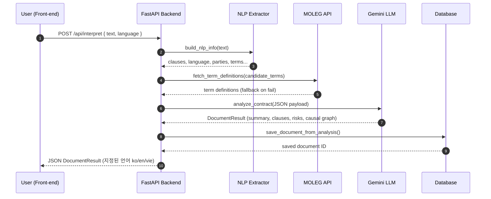
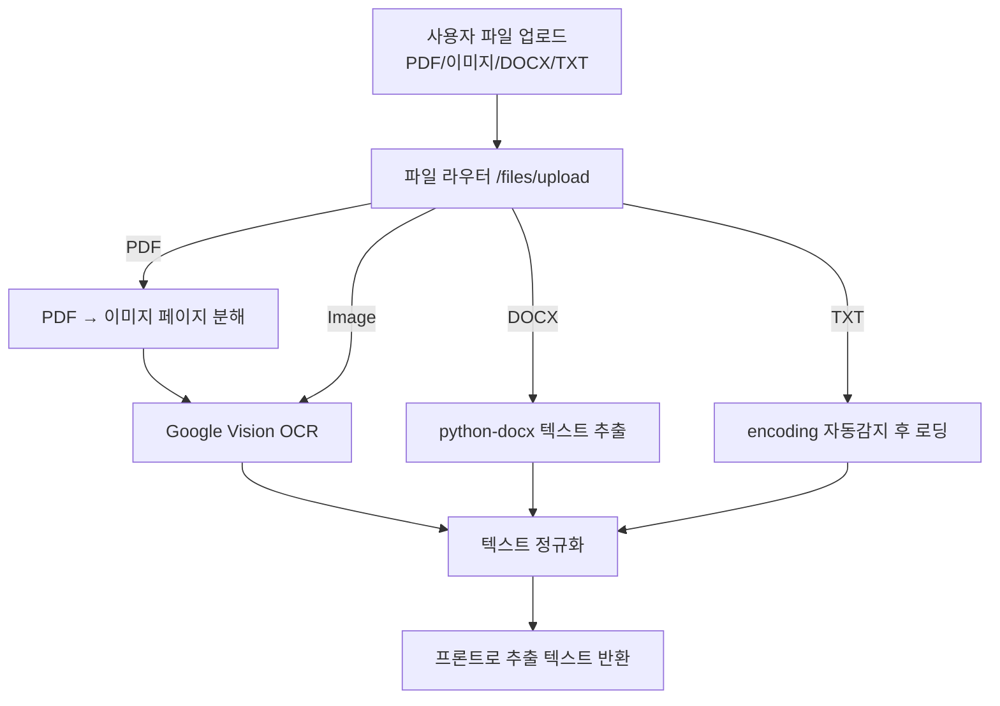
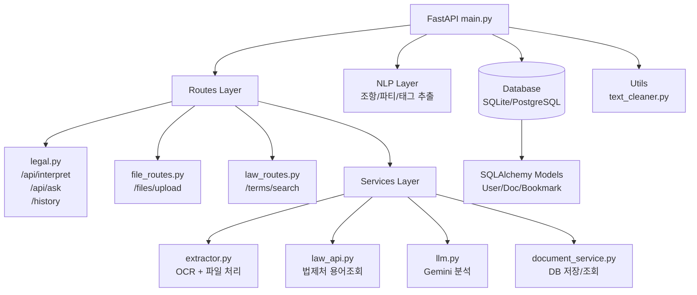

# ⚖️ Legal AI Backend  
FastAPI 기반 계약서/법률 문서 자동 분석 백엔드

본 백엔드는 계약서·법률 문서를 업로드하면:
1. OCR (Google Vision)
2. NLP 전처리 (조항 단위 추출, 용어 candidate, 도메인/당사자 파악)
3. 법제처 API 용어정의 조회
4. Gemini 기반 심층 분석(JSON-only)
5. DB 저장 (문서·조항·용어 구조화 저장).   
까지 자동으로 처리하는 법률 문서 AI 분석 백엔드입니다.    
한국어, 영어, 베트남어 3개 언어 요약·분석·설명을 지원합니다.
---

# 1. 백엔드 실행 방법
## 0) 패키지 설치
### 가상환경 만들기 & 활성화
```bash
python3 -m venv venv
source venv/bin/activate

```
## backend 라이브러리 설치
```bash
pip install -r requirements.txt
```
## 1) 서버 실행
프로젝트 루트에서 : 
```bash
cd backend
uvicorn app.main:app --reload
```
## 2) API 문서 확인
```bash
Swagger UI
http://127.0.0.1:8000/docs
OpenAPI JSON
http://127.0.0.1:8000/openapi.json
```


# 2. 환경변수 (.env)
프로젝트 루트에 .env 파일 필요
```bash
GEMINI_API_KEY=YOUR_API_KEY_HERE
MOLEG_API_KEY=YOUR_API_KEY_HERE
GOOGLE_APPLICATION_CREDENTIALS=/path/to/google_vision.json

```

# 3. 주요 기능 요약
### 파일 처리 (app/services/extractor.py)
- PDF → 페이지별 이미지 변환 후 Google Vision OCR
- 이미지(PNG/JPG/JPEG) OCR
- DOCX 파싱
- TXT 인코딩 처리
- HWP는 PDF로 변환 안내
- MIME 타입 자동 판별

### NLP 전처리 (app/nlp/extractor.py)
- 조항 자동 분리(제1조 ~)
- 언어 감지(ko/en/vi) 
- 도메인 태깅(근로/임대차/NDA/IT 등)
- 당사자 추출(근로자/사용자/임대인/임차인)
- 법률 용어 후보 자동 추출
- 불필요 공백/개행 정리

### 법제처 용어 정의 연동 (app/services/law_api.py)
- 병렬 요청(aiohttp)
- 한국어/영문 정의 자동 매핑
- 오류 발생 시 graceful fallback

### LLM 분석 (app/services/llm.py)
- Gemini 2.5 Flash 사용
- JSON-only 출력 강제 프롬프트
- 조항별 요약/리스크/태그 생성
- 문서 전체 요약, 위험도 점수
- 인과관계(causal graph) 생성
- 출력 안정화 및 fallback 처리
- SHA256 기반 캐시로 중복 호출 방지

# 5. 폴더 구조
```bash
backend/
 ├── app/
 │   ├── main.py
 │   ├── routes/
 │   │     ├── legal.py             # 텍스트 분석, 질의응답, 문서 관리
 │   │     ├── file_routes.py       # 파일 업로드, OCR, 분석
 │   │     ├── contract_routes.py   # 계약서 리스트/상세
 │   │     ├── law_routes.py        # 법제처 용어검색
 │   │     └── auth_test.py         # Firebase 인증 확인
 │   ├── services/
 │   │     ├── extractor.py         # OCR + 파일처리
 │   │     ├── law_api.py           # 법제처 DRF API
 │   │     ├── llm.py               # Gemini 분석
 │   │     └── document_service.py  # DB 저장
 │   ├── nlp/extractor.py           # 조항/언어/도메인/용어 추출
 │   ├── db/
 │   │     ├── database.py
 │   │     └── models.py            # User/Document/Clause/Term 등
 │   ├── models/legal.py            # DocumentResult 구조 정의
 │   └── utils/text_cleaner.py
 ├── requirements.txt
 ├── venv/
 └── README.md

```
# 6. 흐름
## 1) 전체 처리


## 2) 파일 업로드 -> OCR -> 분석 흐름

## 3) 전체 백엔드 아키텍처 (Directory 구조 기반)

